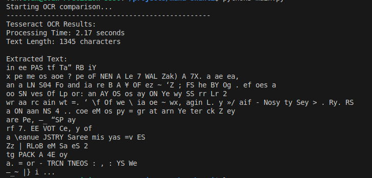

# What
- Played around with comparing the performance of tessaract with google cloud vision.

## Why
- I have physical sheets of paper containing emails, full names, and sometimes phone numbers.

## Initial Conclusion
- Tessaract was effectiely useless, outputting gibberish:

Google OCR, which is reportedly best in class among OCR solutions, managed to capture 3 out of the 20 emails on the page.Not including the results to protect PII ;)

## Reference
Google Cloud Vision Docs - https://cloud.google.com/vision/docs/handwriting#vision_fulltext_detection_gcs-python 
